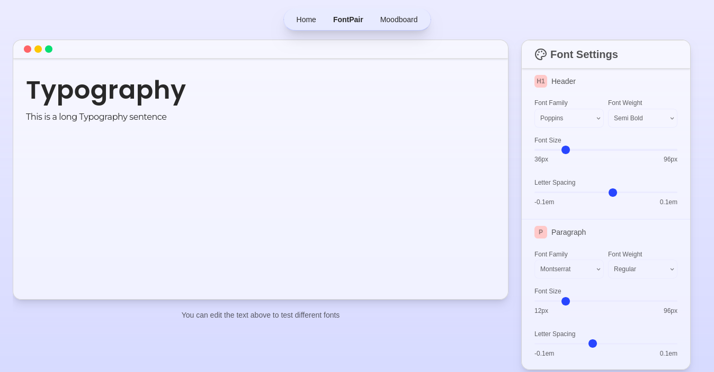
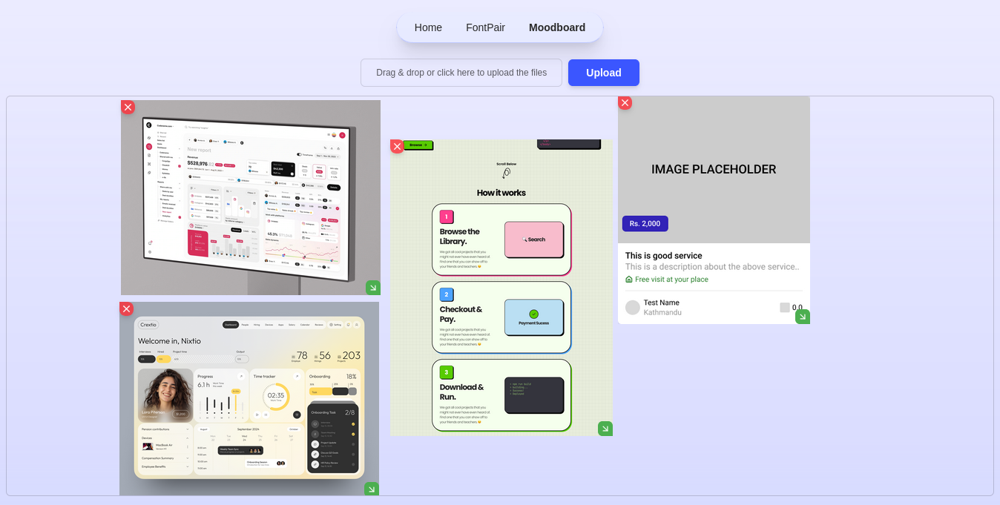

# UIHAVEN
Uihaven is a project for designers and developers. 
It helps you find sweet font combinations and canvas to dump all your inspirations. 
Plan and Start Designing. 
🌐 [UI haven](https://uihaven-design.vercel.app/) 

## Introduction
UI haven is a project I've develop that helps in planning and designing. It provides font pairing which helps you to find find that complements!😉. Moodboard is another feature that provides a canvas to collect images in one place.

## Problem Statement
I have a love for design and for planning a project and I have not been able to find a tool that helps me to plan and design.
Pairing right that perfectlly complements is something that I have not been able to do. And also I have not been able to find a tool that helps me to collect images in one place.

## ✅ Challanges Solved
Uihaven aims to solve these problem by offering:
- Live Font pairing previews with realtime control over the text and fonts
- Moodboard to collect images in one place

## ✨ Features
### Font Pairing
- Live Font pairing previews
- Shuffle Fonts
- Realtime control over the text and fonts

### Moodboard
- Upload multiple images
- Drag and drop to upload images
- Resize and Rearrange the images
  

## Current Limitation
- No authentication
- No database
- Data are not persistent and lacks saving options
- Responsiveness needs more refinement
  

## Future Improvements
- Authentication
- Database
- Saving options
- Implement AI for font pairing

## Screenshots

